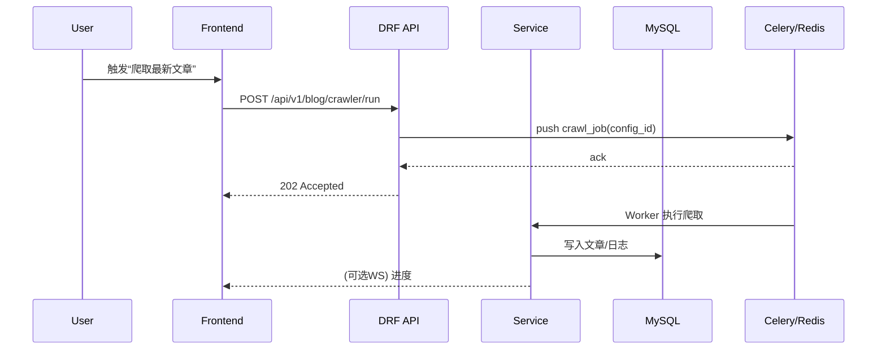

# 技术架构 - 系统架构

## 1. 总览
采用“前后端分离 + 模块化 + 任务队列 + 可选搜索/向量库”的分层架构，保留现有 Django/DRF + Vue3/Element Plus 基座，最小改造实现模块化扩展与权限统一。

```
用户端
├── Web（PC/Pad/Mobile，自适应）
└── API Client（脚本/工具）

前端（Vue3 + Vite + Pinia + Router + Element Plus）
├── 全局壳（布局/导航/主题/权限指令）
├── 模块应用（博客/英语/求职/待办/AI/系统）
└── 公共组件（表单/表格/上传/编辑器/可视化）

后端（Django 4.2 + DRF + SimpleJWT）
├── API 层（REST/WebSocket）
├── 应用层（服务/权限/工作流/审计）
├── 领域层（模型/领域服务/仓储接口）
├── 基础设施（ORM/缓存/对象存储/外部服务）
└── 任务队列（Celery + Redis）

数据与检索
├── MySQL 8（业务数据）
├── Redis（缓存/队列/限流/会话）
├── Elasticsearch（可选全文检索）
└── Chroma + SentenceTransformer（向量检索，AI/RAG）

运维
├── Docker/Compose + Nginx 反向代理
├── Prometheus + Grafana（监控）
└── 备份/日志/告警（极简）
```

## 2. 模块边界与依赖
- 博客：文章/分类/标签/爬虫策略/爬取日志/统计；提供搜索与推荐。
- 英语：词库/表达/新闻/发音与记录/进度；外部数据导入与定时更新。
- 求职：简历模板/版本/导出（Word/PDF）/公司评价/面试记录。
- 待办：任务/子任务/提醒（定时/周期）/统计；与邮件/推送集成。
- AI：会话/消息/模型/知识库（文档切块/向量化/检索）；RAG。
- 系统：用户/角色/权限（模块/功能/数据级）/审计/模块管理。

依赖方向：模块仅依赖“系统/公共库”，跨模块通信通过服务/事件或共享服务（如搜索、AI知识库）。

## 3. 权限统一
- 统一权限码：`<module>.<feature>` 与 `<module>.access`；数据级：`data.own/module/all`。
- 前端：路由守卫 + 权限指令；后端：DRF 权限类 + 装饰器；审计：操作落库。

## 4. 关键服务与流转
### 4.1 认证与状态
- SimpleJWT（短期 Access + Refresh）；Redis 黑名单；登录IP/设备落库。

### 4.2 爬虫与定时
- Celery Beat 调度 → 任务队列（Redis）→ Worker 拉取执行 → 结果落库 → 审计与告警。

### 4.3 搜索与推荐
- 可选 ES：文章/笔记/公司信息建索引；如关闭 ES，退化为 MySQL + 简易全文索引。

### 4.4 AI/RAG
- 文档上传 → 切块 → 向量化（SentenceTransformer）→ Chroma 入库
- 对话：构造上下文（最近N轮 + 检索TopK）→ 模型生成（本地/云）→ 消息落库。

### 4.5 实时能力
- WebSocket（Django Channels/ASGI）用于：AI 流式响应、提醒推送、爬虫进度广播（可选）。

## 5. 配置与多环境
- `settings/` 按 base/dev/prod 分层；敏感信息来自环境变量（.env）。
- Feature Flags：按模块启停与参数（如是否启用ES/AI）。

## 6. 可观测性
- 结构化日志（JSON 可选）；Nginx/后端/队列日志归集。
- Prometheus 指标（进程、HTTP、Celery）+ Grafana 仪表盘；基础告警（CPU/内存/磁盘/HTTP 5xx）。

## 7. 伸缩与容错
- 单机 2GB 策略：限制 Celery 并发、ES 可关；静态资源缓存；数据库连接池小型化。
- 水平扩展（后续）：前后端容器多副本 + Nginx 轮询；MySQL 读写分离（可选）。

## 8. 安全基线
- HTTPS 强制；JWT 最小化声明；权限审计；上传白名单与大小限制；速率限制与防爆破；依赖漏洞扫描。

## 9. 典型时序（示例）


## 10. 模块目录约定（后端）
```
apps/
  common/ (基类/工具/异常/分页/权限基类)
  users/  (用户/资料/登录日志/权限接口)
  blog/   (文章/分类/标签/爬虫/统计)
  english/(词库/表达/新闻/发音/进度)
  job/    (简历/模板/公司/面试/技能)
  todo/   (任务/提醒/笔记/统计)
  ai/     (会话/消息/模型/知识库)
```

## 11. 风险与缓解
- 2GB 内存：队列并发/ES关闭策略、应用内缓存命中率优化。
- 外部源变动：爬虫策略配置化+回退；容错重试与告警。
- AI 资源：本地轻量模型优先，云端按需调用，设置配额与缓存。

（本架构与现有代码结构兼容，支持按模块独立升级与开关。）

## 12. 现有系统集成机制（基于已上线博客平滑扩展）

### 12.1 前端集成
- 动态按需注入路由与模块，避免侵入既有路由：
```javascript
function registerModuleRoutes(routes) {
  routes.forEach((r) => {
    if (!router.hasRoute(r.name)) router.addRoute(r)
  })
}
```
- 模块化状态：每个模块自带独立 Pinia store 与命名空间。
- 权限驱动导航：基于 `<module>.access` 过滤可见菜单与可达路由。

### 12.2 后端集成
- 仅在 `INSTALLED_APPS` 追加新模块，保留原顺序，不改动既有 `users`/`articles` 业务：
```python
# settings.py 片段
INSTALLED_APPS = [
    'apps.users', 'apps.articles',
    # 新增模块：
    'apps.english', 'apps.job', 'apps.todo', 'apps.ai',
]
```
- 统一权限码：`<module>.access`、`<module>.<feature>`；数据级权限通过策略与装饰器实现。
- 审计统一：关键操作接入审计流水，便于追踪。

### 12.3 数据迁移策略
- 核心表不改或最小化改动（可空/默认值）。
- 新模块独立迁移与灰度开关：
```bash
python manage.py makemigrations english
python manage.py migrate english --database=default
```
- 回滚与影子校验按需启用。

## 13. 集成风险与缓解
- 路由/命名冲突：采用命名空间与 `hasRoute` 检查；规范化路由命名。
- 权限穿透：后端强校验（DRF 权限类/装饰器）+ 前端守卫；默认拒绝原则。
- 资源瓶颈：2GB 策略（Celery 并发=1、强缓存、必要时关闭 ES）。
- 迁移失败：小步快跑、可回滚；预发验证与数据快照。

