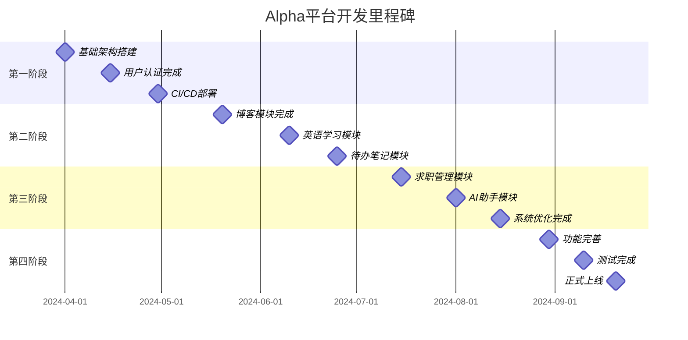

# 开发计划 - 开发阶段

## 1. 开发阶段概述

### 1.1 总体策略
- **迭代开发**：采用敏捷开发方法，分阶段迭代实现
- **模块优先**：按模块重要性和依赖关系安排开发顺序
- **风险控制**：优先解决技术难点和高风险项目
- **用户反馈**：每个阶段完成后收集用户反馈并调整
- **质量保证**：每个阶段都包含完整的测试和文档

### 1.2 开发原则
- **最小可行产品(MVP)**：每个阶段都能提供可用的功能
- **持续集成**：代码持续集成和自动化部署
- **代码质量**：严格的代码审查和质量标准
- **文档同步**：开发过程中同步更新文档
- **安全优先**：从设计阶段就考虑安全性

## 2. 阶段划分

### 2.1 第一阶段：基础架构搭建 (4-6周)

#### 2.1.1 阶段目标
- 搭建完整的开发环境和基础架构
- 实现用户认证和权限系统
- 完成基础的界面框架
- 建立CI/CD流程

#### 2.1.2 主要任务

##### 后端开发
```
基础架构 (Week 1-2)
├── 项目初始化
│   ├── Django项目结构调整
│   ├── 数据库设计优化
│   ├── Docker容器化配置
│   └── 环境配置管理
├── 用户认证系统
│   ├── JWT认证实现
│   ├── 用户注册/登录
│   ├── 密码重置功能
│   └── 邮箱验证
├── 权限管理系统
│   ├── 角色权限模型
│   ├── 权限验证中间件
│   ├── API权限控制
│   └── 权限管理界面
└── 基础API设计
    ├── RESTful API规范
    ├── 统一响应格式
    ├── 错误处理机制
    └── API文档生成
```

##### 前端开发
```
界面框架 (Week 2-3)
├── 项目结构优化
│   ├── Vue3 + Vite配置
│   ├── Element Plus集成
│   ├── 路由配置
│   └── 状态管理(Pinia)
├── 基础组件开发
│   ├── 布局组件
│   ├── 导航组件
│   ├── 表单组件
│   └── 通用组件
├── 响应式设计
│   ├── 断点系统
│   ├── 移动端适配
│   ├── 主题系统
│   └── 国际化准备
└── 用户界面
    ├── 登录/注册页面
    ├── 用户中心
    ├── 权限管理界面
    └── 系统设置
```

##### DevOps配置
```
部署环境 (Week 3-4)
├── 服务器环境配置
│   ├── CentOS 7环境准备
│   ├── Docker安装配置
│   ├── Nginx配置
│   └── SSL证书配置
├── CI/CD流程
│   ├── Git工作流设计
│   ├── 自动化构建
│   ├── 自动化测试
│   └── 自动化部署
├── 监控系统
│   ├── 应用监控
│   ├── 服务器监控
│   ├── 日志收集
│   └── 告警配置
└── 备份策略
    ├── 数据库备份
    ├── 代码备份
    ├── 配置备份
    └── 恢复测试
```

#### 2.1.3 交付物
- [x] 完整的开发环境
- [x] 用户认证和权限系统
- [x] 基础的前端框架
- [x] CI/CD部署流程
- [x] 系统监控和日志
- [x] 技术文档和部署文档

#### 2.1.4 验收标准
- 用户可以正常注册、登录、管理权限
- 前端界面响应式适配良好
- CI/CD流程运行正常
- 系统监控指标正常
- 代码覆盖率达到80%以上

### 2.2 第二阶段：核心模块开发 (6-8周)

#### 2.2.1 阶段目标
- 实现博客模块的完整功能
- 开发英语学习模块的基础功能
- 完成待办笔记模块
- 建立数据爬虫系统

#### 2.2.2 主要任务

##### 博客模块 (Week 5-7)
```
博客功能开发
├── 文章管理系统
│   ├── 文章CRUD操作
│   ├── Markdown编辑器
│   ├── 文章分类和标签
│   ├── 文章状态管理
│   ├── 版本控制
│   └── 文章搜索
├── 内容展示
│   ├── 文章列表页面
│   ├── 文章详情页面
│   ├── 分类页面
│   ├── 标签页面
│   ├── 归档页面
│   └── 搜索结果页面
├── 爬虫系统
│   ├── 爬虫配置管理
│   ├── 网站爬取规则
│   ├── 内容质量检测
│   ├── 重复内容过滤
│   ├── 定时任务调度
│   └── 爬取日志记录
└── 数据分析
    ├── 阅读统计
    ├── 热门文章
    ├── 访问分析
    └── 内容推荐
```

##### 英语学习模块 (Week 6-8)
```
英语学习功能
├── 词汇管理
│   ├── 单词库建设
│   ├── 个人单词本
│   ├── 单词学习计划
│   ├── 记忆曲线算法
│   └── 单词测试
├── 表达学习
│   ├── 常用表达库
│   ├── 表达分类
│   ├── 语境示例
│   └── 表达练习
├── 新闻阅读
│   ├── 英文新闻爬取
│   ├── 难度分级
│   ├── 生词标注
│   ├── 阅读理解
│   └── 学习记录
└── 学习进度
    ├── 学习统计
    ├── 进度追踪
    ├── 成就系统
    └── 学习报告
```

##### 待办笔记模块 (Week 7-8)
```
待办笔记功能
├── 任务管理
│   ├── 任务创建和编辑
│   ├── 任务分类和标签
│   ├── 优先级设置
│   ├── 截止日期管理
│   ├── 任务状态跟踪
│   └── 子任务支持
├── 笔记系统
│   ├── Markdown笔记
│   ├── 笔记分类
│   ├── 笔记标签
│   ├── 笔记搜索
│   ├── 笔记导出
│   └── 笔记分享
├── 提醒系统
│   ├── 定时提醒
│   ├── 邮件提醒
│   ├── 浏览器通知
│   ├── 重复提醒
│   └── 智能提醒
└── 数据统计
    ├── 完成率统计
    ├── 效率分析
    ├── 习惯养成
    └── 时间分析
```

#### 2.2.3 交付物
- [x] 完整的博客模块
- [x] 英语学习基础功能
- [x] 待办笔记模块
- [x] 数据爬虫系统
- [x] 用户使用手册

#### 2.2.4 验收标准
- 用户可以完整使用博客功能
- 英语学习模块基础功能正常
- 待办笔记功能完整可用
- 爬虫系统稳定运行
- 模块间数据互通正常

### 2.3 第三阶段：高级功能开发 (4-6周)

#### 2.3.1 阶段目标
- 完成求职管理模块
- 实现AI助手模块基础功能
- 优化系统性能
- 完善用户体验

#### 2.3.2 主要任务

##### 求职管理模块 (Week 9-11)
```
求职管理功能
├── 简历系统
│   ├── 简历模板设计
│   ├── 在线简历编辑
│   ├── Word简历生成
│   ├── PDF简历导出
│   ├── 简历版本管理
│   └── 简历预览分享
├── 求职跟踪
│   ├── 职位信息管理
│   ├── 申请记录跟踪
│   ├── 面试安排
│   ├── 进度状态更新
│   ├── 结果记录
│   └── 数据统计分析
├── 公司管理
│   ├── 公司信息收集
│   ├── 公司评价系统
│   ├── 面试记录
│   ├── 薪资信息
│   └── 行业分析
└── 技能管理
    ├── 技能评估
    ├── 技能匹配
    ├── 学习建议
    └── 技能证书
```

##### AI助手模块 (Week 10-12)
```
AI助手功能
├── 对话系统
│   ├── 聊天界面
│   ├── 对话历史
│   ├── 上下文管理
│   ├── 多轮对话
│   └── 对话导出
├── 模型管理
│   ├── 本地模型支持
│   ├── API模型集成
│   ├── 模型切换
│   ├── 参数配置
│   └── 性能监控
├── 知识库
│   ├── 文档导入
│   ├── 知识检索
│   ├── 语义搜索
│   ├── 知识图谱
│   └── 智能问答
└── 智能推荐
    ├── 内容推荐
    ├── 学习建议
    ├── 工作提醒
    └── 个性化定制
```

##### 系统优化 (Week 11-12)
```
性能优化
├── 前端优化
│   ├── 代码分割
│   ├── 懒加载
│   ├── 缓存策略
│   ├── 图片优化
│   └── 打包优化
├── 后端优化
│   ├── 数据库优化
│   ├── 查询优化
│   ├── 缓存机制
│   ├── 异步处理
│   └── 负载均衡
├── 用户体验优化
│   ├── 界面优化
│   ├── 交互优化
│   ├── 错误处理
│   ├── 加载状态
│   └── 反馈机制
└── 安全加固
    ├── 权限加固
    ├── 数据加密
    ├── 防攻击措施
    └── 安全审计
```

#### 2.3.3 交付物
- [x] 求职管理模块
- [x] AI助手基础功能
- [x] 系统性能优化报告
- [x] 安全测试报告
- [x] 用户体验优化报告

#### 2.3.4 验收标准
- 求职管理功能完整可用
- AI助手基础对话功能正常
- 系统响应时间优化30%以上
- 安全测试通过
- 用户体验评分达到4.0以上

### 2.4 第四阶段：完善和优化 (3-4周)

#### 2.4.1 阶段目标
- 完善所有模块功能
- 系统整体测试和优化
- 用户培训和文档完善
- 正式上线准备

#### 2.4.2 主要任务

##### 功能完善 (Week 13-14)
```
功能完善
├── 模块间集成
│   ├── 数据互通
│   ├── 功能联动
│   ├── 统一搜索
│   └── 统一设置
├── 高级功能
│   ├── 数据导入导出
│   ├── 批量操作
│   ├── 快捷键支持
│   └── 插件系统
├── 移动端优化
│   ├── 响应式完善
│   ├── 触摸优化
│   ├── 离线支持
│   └── PWA功能
└── 个性化定制
    ├── 主题定制
    ├── 布局定制
    ├── 功能定制
    └── 数据定制
```

##### 测试和质量保证 (Week 14-15)
```
测试阶段
├── 功能测试
│   ├── 单元测试
│   ├── 集成测试
│   ├── 系统测试
│   └── 回归测试
├── 性能测试
│   ├── 负载测试
│   ├── 压力测试
│   ├── 并发测试
│   └── 稳定性测试
├── 安全测试
│   ├── 权限测试
│   ├── 注入测试
│   ├── XSS测试
│   └── CSRF测试
├── 兼容性测试
│   ├── 浏览器兼容
│   ├── 设备兼容
│   ├── 系统兼容
│   └── 分辨率测试
└── 用户体验测试
    ├── 易用性测试
    ├── 可访问性测试
    ├── 用户反馈收集
    └── 体验优化
```

##### 文档和培训 (Week 15-16)
```
文档完善
├── 技术文档
│   ├── API文档
│   ├── 部署文档
│   ├── 运维文档
│   └── 开发文档
├── 用户文档
│   ├── 用户手册
│   ├── 功能介绍
│   ├── 常见问题
│   └── 视频教程
├── 管理文档
│   ├── 管理员手册
│   ├── 权限配置
│   ├── 数据管理
│   └── 备份恢复
└── 培训准备
    ├── 培训计划
    ├── 培训材料
    ├── 演示环境
    └── 反馈收集
```

#### 2.4.3 交付物
- [x] 完整的系统功能
- [x] 全面的测试报告
- [x] 完善的文档体系
- [x] 用户培训材料
- [x] 上线部署方案

#### 2.4.4 验收标准
- 所有功能模块正常运行
- 测试覆盖率达到90%以上
- 文档完整性达到100%
- 用户满意度达到4.5以上
- 系统稳定性达到99.9%

## 3. 里程碑管理

### 3.1 关键里程碑



### 3.2 里程碑检查点

#### 3.2.1 每周检查点
- **代码提交**：每日代码提交和代码审查
- **功能演示**：每周功能演示和进度汇报
- **问题跟踪**：每周问题收集和解决方案
- **质量检查**：每周代码质量和测试覆盖率检查

#### 3.2.2 阶段检查点
- **功能验收**：阶段功能完整性验收
- **性能测试**：阶段性能指标测试
- **安全审查**：阶段安全性审查
- **用户反馈**：阶段用户体验反馈收集

#### 3.2.3 风险评估
- **技术风险**：技术难点和解决方案评估
- **进度风险**：开发进度和资源评估
- **质量风险**：代码质量和bug风险评估
- **用户风险**：用户需求变更风险评估

## 4. 资源分配

### 4.1 人力资源配置

#### 4.1.1 开发团队结构
```
开发团队 (建议配置)
├── 项目经理 (1人)
│   ├── 项目规划和管理
│   ├── 进度跟踪和协调
│   ├── 风险控制和决策
│   └── 对外沟通和汇报
├── 后端开发 (2人)
│   ├── 架构设计和开发
│   ├── API设计和实现
│   ├── 数据库设计和优化
│   └── 系统集成和测试
├── 前端开发 (2人)
│   ├── 界面设计和开发
│   ├── 交互逻辑实现
│   ├── 响应式适配
│   └── 性能优化
├── DevOps工程师 (1人)
│   ├── 环境搭建和配置
│   ├── CI/CD流程建设
│   ├── 监控和运维
│   └── 安全和备份
└── 测试工程师 (1人)
    ├── 测试计划和用例
    ├── 自动化测试
    ├── 性能和安全测试
    └── 质量保证
```

#### 4.1.2 技能要求
- **后端开发**：Python/Django, RESTful API, 数据库设计, Redis, Celery
- **前端开发**：Vue3, TypeScript, Element Plus, 响应式设计, 性能优化
- **DevOps**：Docker, Linux, Nginx, CI/CD, 监控系统
- **测试**：自动化测试, 性能测试, 安全测试, 质量管理

### 4.2 时间资源分配

#### 4.2.1 阶段时间分配
```
总开发周期：16-20周
├── 第一阶段：4-6周 (25-30%)
├── 第二阶段：6-8周 (35-40%)
├── 第三阶段：4-6周 (25-30%)
└── 第四阶段：3-4周 (15-20%)
```

#### 4.2.2 任务时间分配
```
任务类型时间分配
├── 核心功能开发：60%
├── 测试和质量保证：20%
├── 文档和培训：10%
├── 部署和运维：5%
└── 缓冲时间：5%
```

### 4.3 技术资源配置

#### 4.3.1 开发环境
- **开发服务器**：用于开发环境部署和测试
- **测试服务器**：用于集成测试和性能测试
- **生产服务器**：阿里云服务器，CentOS 7，2GB RAM，40GB磁盘

#### 4.3.2 开发工具
- **代码管理**：Git + GitHub/GitLab
- **项目管理**：Jira/Trello/GitHub Projects
- **文档管理**：Confluence/Notion/GitBook
- **通信协作**：Slack/钉钉/企业微信

## 5. 质量保证

### 5.1 代码质量标准

#### 5.1.1 编码规范
- **Python代码**：遵循PEP 8规范
- **JavaScript代码**：遵循ESLint规范
- **Vue组件**：遵循Vue官方风格指南
- **CSS样式**：遵循BEM命名规范

#### 5.1.2 代码审查
- **提交前审查**：所有代码提交前必须经过审查
- **功能审查**：功能完成后进行整体审查
- **安全审查**：定期进行安全代码审查
- **性能审查**：关键功能进行性能代码审查

#### 5.1.3 测试覆盖率
- **单元测试**：覆盖率不低于80%
- **集成测试**：覆盖率不低于70%
- **端到端测试**：覆盖主要用户流程
- **性能测试**：覆盖关键性能指标

### 5.2 质量控制流程

#### 5.2.1 开发阶段质量控制
```
开发质量控制
├── 需求分析阶段
│   ├── 需求评审
│   ├── 技术可行性分析
│   ├── 风险评估
│   └── 验收标准定义
├── 设计阶段
│   ├── 架构设计评审
│   ├── 接口设计评审
│   ├── 数据库设计评审
│   └── 安全设计评审
├── 编码阶段
│   ├── 编码规范检查
│   ├── 代码审查
│   ├── 单元测试
│   └── 静态代码分析
└── 测试阶段
    ├── 功能测试
    ├── 集成测试
    ├── 性能测试
    └── 安全测试
```

#### 5.2.2 质量度量指标
- **功能质量**：功能完整性、正确性、稳定性
- **性能质量**：响应时间、吞吐量、资源利用率
- **安全质量**：漏洞数量、安全等级、合规性
- **维护质量**：代码可读性、可维护性、可扩展性

### 5.3 风险管理

#### 5.3.1 技术风险
- **技术选型风险**：新技术学习成本和稳定性
- **性能风险**：系统性能瓶颈和优化难度
- **兼容性风险**：浏览器和设备兼容性问题
- **安全风险**：数据安全和隐私保护

#### 5.3.2 项目风险
- **进度风险**：开发进度延期和资源不足
- **需求风险**：需求变更和范围蔓延
- **人员风险**：人员流动和技能不匹配
- **外部风险**：第三方服务依赖和环境变化

#### 5.3.3 风险应对策略
- **风险识别**：定期风险评估和识别
- **风险评估**：风险影响度和概率评估
- **风险应对**：风险避免、减轻、转移、接受
- **风险监控**：持续监控和应对措施调整

## 6. 成功标准

### 6.1 技术成功标准

#### 6.1.1 功能完整性
- 所有规划功能模块100%实现
- 核心功能用户流程100%可用
- 系统集成度达到设计要求
- 数据一致性和完整性保证

#### 6.1.2 性能指标
- 页面加载时间 < 3秒
- API响应时间 < 500ms
- 系统可用性 > 99.5%
- 并发用户数 > 100

#### 6.1.3 质量指标
- 代码覆盖率 > 80%
- 安全漏洞数量 = 0
- 关键bug数量 < 5
- 用户体验评分 > 4.0

### 6.2 业务成功标准

#### 6.2.1 用户满意度
- 用户满意度调查 > 4.0/5.0
- 用户留存率 > 80%
- 功能使用率 > 60%
- 用户反馈积极率 > 85%

#### 6.2.2 系统稳定性
- 系统故障次数 < 2次/月
- 数据丢失事件 = 0
- 安全事件 = 0
- 恢复时间 < 1小时

### 6.3 项目成功标准

#### 6.3.1 交付标准
- 按时交付率 = 100%
- 预算控制率 < 110%
- 范围变更率 < 10%
- 质量标准达成率 = 100%

#### 6.3.2 团队成功标准
- 团队满意度 > 4.0/5.0
- 知识传承完整性 = 100%
- 文档完整性 = 100%
- 技能提升达成率 > 80%

 这个开发阶段计划提供了详细的分阶段开发策略，包括每个阶段的具体任务、交付物、验收标准等，确保项目能够按计划有序推进并达到预期目标。

## 附：改造阶段（基于现有系统）

### 阶段0：现有系统分析（1周）
- 数据库结构逆向与差异清单：
```bash
python manage.py inspectdb > legacy_models.py
```
- 权限兼容性评估：新权限码与旧接口并存方案；
- 部署流水线适配：确认 CI/CD 对新增模块无侵入。

### 阶段1：集成框架搭建（2周）
- 动态路由加载与权限驱动导航：
```javascript
export function registerModuleRoutes(routes) {
  routes.forEach(r => { if (!router.hasRoute(r.name)) router.addRoute(r) })
}
```
- 模块化状态管理：各模块独立 Pinia store 与命名空间；
- 权限扩展接口：
```python
def has_module_access(user, module_name: str) -> bool:
    return user.has_perm(f"{module_name}.access")
```

